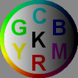
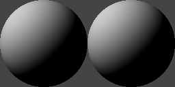
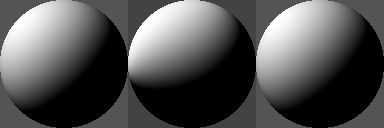

On Wayland-based platforms (i.e. very new Linux systems), setting `SDL_VIDEODRIVER=x11`
may be needed for the SDL example; the equivalent for the GLUT example is `PYOPENGL_PLATFORM=glx` (not needed on Fedora 40 Wayland).

The `skparagraph-example` example generates the below as an example of multilingual paragraph layout.
Note on Linux, it is highly sensitive to locale, and you might need to unset `LANG` and `FC_LANG` if you have unusual
(non-English) settings.

`SkSL_ShaderMulti+SDL2.py` is a port of the animation on https://shaders.skia.org/ . Run it with a number argument (0 to 6) for the 7 examples on https://shaders.skia.org/ .

## SkSL examples

original:

`SkSL_CoordinateSpaces.py`:

`SkSL_EvaluatingImageShader.py` (swap red and blue):

`SkSL_EvaluatingTwoShaders.py` (Image with Gradient):

`SkSL_EvaluatingNestedShaders.py` (Image with same Gradient as shader too):

`SkSL_MinifiedSkSL.py`: (this is not a separate SkSL example, but how to generate Minified SkSL with Skia's `minifier` tool
for the same result as `SkSL_PremultipliedAlpha.py` below):

`SkSL_PremultipliedAlpha.py`:

`SkSL_LinearSRGB.py`:

`SkSL_Uniforms.py`:

`SkSL_RawImageShaders.py`:

